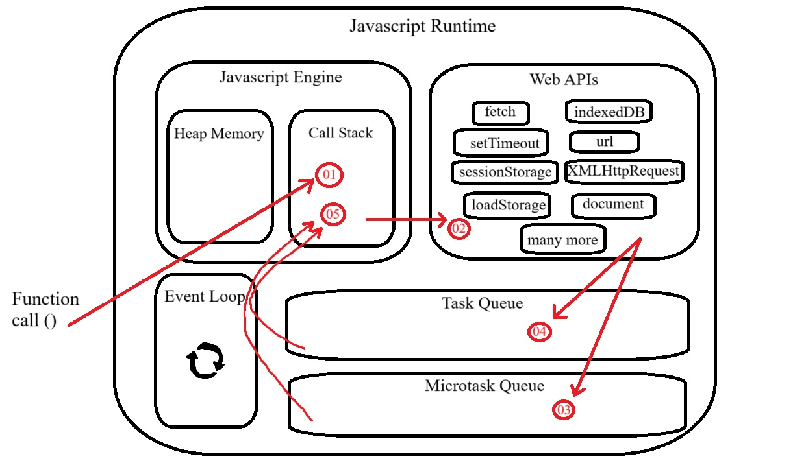

# Modelo de Concorrência

Um modelo de concorrência ou simultaneidade especifica como os threads do sistema colaboram para concluir as tarefas que lhes são atribuídas. Diferentes modelos de concorrência dividem as tarefas de diferentes maneiras, e os threads podem se comunicar e colaborar de diferentes maneiras.

# Modelo de Concorrência no JavaScript

O JavaScript tem um ambiente de execução (runtime) baseado em um **event loop** (laço de eventos) que é responsável por executar, coletar, processar eventos e executar sub-tarefas enfileiradas. Esse modelo é bem diferente dos modelos de outras linguagens de programação tais como C e Java.

O ambiente de execução do JavaScript é de thread única, o que significa que ele pode executar apenas um trecho de código por vez, porém seu modelo de concorrência baseado em eventos e um loop de eventos o torna altamente eficaz para lidar com operações assíncronas, como I/O, sem bloquear a execução do programa, ou seja, a execução de operações assíncronas não bloqueia o fluxo principal do programa.

## Javascript Runtime

 

 

### Componentes do Modelo

- **Call Stack**

Armazena as funções que estão sendo executadas atualmente. É uma estrutura LIFO (Last In, First Out). Exemplo: Quando uma função é chamada, ela é adicionada à pilha, e quando retorna, é removida.

Armazena também as callbacks síncronas executadas imediatamente (como as de .forEach() ou funções chamadas diretamente).

- **Task Queue**

Armazena Callbacks relacionadas a Web APIs (como setTimeout, setInterval, eventos DOM, etc.), tarefas assíncronas que foram concluídas e estão aguardando para ser executadas no próximo ciclo do event loop. Exemplo: Callbacks de setTimeout, setInterval, ou eventos como cliques.

As tarefas na Task Queue são enviadas pelo Event Loop para a Call Stack apenas se a Call Stack estiver vazia. O Event Loop verifica continuamente se a Call Stack está vazia antes de remover a função da Task Queue e enviar à Call Stack.

Além disso a Microtask Queue tem prioridade sobre a Task Queue, sendo assim, as funções da Task Queue são enviadas para a Call Stack somente se: Primeiro, a Microtask Queue estiver vazia e segundo se a Call Stack estiver vazia.

- **Microtask Queue**

Fila especial dedicada aos callbacks `then()`, `catch()`, `finally()`, corpo de execução de uma função depois da palavra reservada `await`, 

Armazena tarefas de maior prioridade, como Promises resolvidas e MutationObservers. É esvaziada antes da task queue em cada ciclo do event loop. `queueMicrotask()` callback e `new MutationObserver()` callback. Apenas esses callbacks ou corpos de funções são enfileirados na Microtask Queue.

### Fluxo de Execução

- **1º: O event loop verifica se a call stack está vazia.**

- **2º: Se estiver, ele pega as tarefas da microtask queue e executa.**

- **3º: Depois de esvaziar as microtarefas, ele processa as tarefas da task queue.**

- **4º: Repete esse ciclo continuamente.**

 

# Referências

- [Concurrency Models](https://jenkov.com/tutorials/java-concurrency/concurrency-models.html#:~:text=A%20concurrency%20model%20specifies%20how,and%20collaborate%20in%20different%20ways.)

- [Memory Management: Concurrency Model and Event Loop](./resources/concurrency-model-&-event-loop.pdf)

- [JavaScript Concurrency Model and Event Loop](https://www.freecodecamp.org/news/javascript-concurrency-model-and-event-loop/)

- [JavaScript Visualized - Event Loop, Web APIs, (Micro)task Queue](https://youtu.be/eiC58R16hb8?si=IbRVr148nlfFg_qZ)