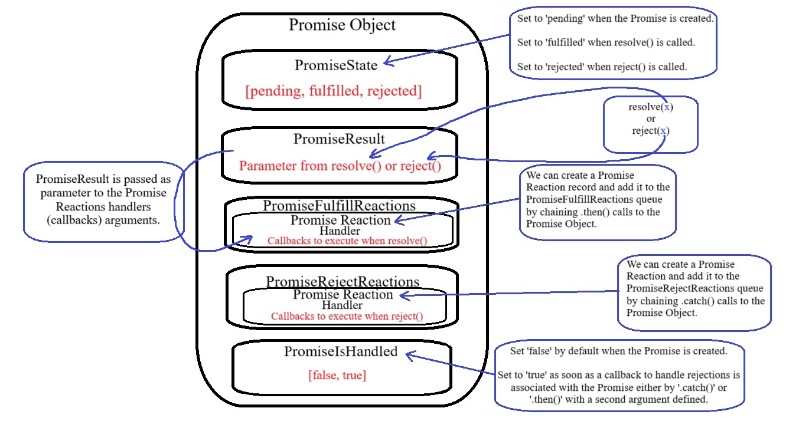

# Promise

Uma Promise é um **objeto** que representa a eventual conclusão ou falha de uma operação assíncrona.

Objetos Promise geralmente são retornados por funções assíncronas. Esse é um dos usos principais das Promises no JavaScript: encapsular operações assíncronas e seus resultados, permitindo que o código gerencie essas operações de maneira mais clara e organizada.

A Promise é criada usando o construtor Promise, que recebe uma função executora como argumento. Essa função executora tem dois argumentos: resolve e reject.

```
let minhaPromise = new Promise((resolve, reject) => {})
```

Os argumentos `resolve` e `reject` são funções callback.

**Descrição breve da documentação:** `A callback used to initialize the promise. This callback is passed two arguments: a resolve callback used to resolve the promise with a value or the result of another promise, and a reject callback used to reject the promise with a provided reason or error.`

## .then(onFulfilled, onRejected), .catch(onRejected), .finally()

Um objeto Promise possui as funções `.then()`, `.cathc()` e `.finally()`.

Os métodos `.then()`, `.catch()` e `.finally()` são usados no JavaScript para lidar com promessas (Promises). Cada um desempenha um papel específico no gerenciamento do fluxo de execução e manipulação de resultados ou erros.

Tendo em vista que esses três métodos retornam objetos Promise, podemos usá-los de forma aninhada.

### 1 .then()

O método .then() é usado para lidar com o resultado de uma promessa resolvida (ou seja, quando o estado da Promise muda para fulfilled). Ele recebe uma função como argumento, que será chamada com o valor retornado pela promessa - nesse caso o parametro passado ao método resolve().

Sintaxe: `promise.then(onFulfilled, onRejected);`

- `onFulfilled`: Função executada se a promessa for resolvida com sucesso.

- `onRejected` (opcional): Função executada se a promessa for rejeitada.

O método `.then()` sempre retorna uma nova Promise.

### 2 .catch()

O método .catch() é usado para capturar e tratar erros (ou promessas rejeitadas). Ele é equivalente a passar a função de erro como o segundo argumento de .then().

Sintaxe: `promise.catch(onRejected);`

- `onRejected`: Função executada quando a promessa for rejeitada.

Assim como `.then()`, `.catch()` retorna uma nova Promise.

### 3 .finally()

O método .finally() é usado para executar uma função após a Promise ser concluída, independentemente de seu resultado (resolvido ou rejeitado). Ele é útil para realizar tarefas de limpeza ou ações finais que devem ocorrer em qualquer caso.

Sintaxe: `promise.finally(onFinally);`

- `onFinally`: Função executada após a promessa ser resolvida ou rejeitada.

O método `.finally()` também retorna uma nova Promise.

## Modelo Interno de Funcionamento das Promises no JavaScript

<br/>



<br/>

### 1 PromiseState

Representa o estado da Promise.
Pode assumir três valores:

- "**pending**" (pendente): A operação ainda não foi resolvida nem rejeitada.

- "**fulfilled**" (resolvida): A operação foi concluída com sucesso.

- "**rejected**" (rejeitada): A operação falhou.

O estado inicial é sempre "pending". Ele só pode mudar uma vez, de pending para fulfilled ou rejected.

### 2 PromiseResult

Representa o valor associado à resolução ou rejeição da Promise.

- No estado **fulfilled**, é o valor passado para resolve(`value`).

- No estado **rejected**, é o valor passado para reject(`reason`).

Enquanto a Promise está no estado **pending**, o PromiseResult é `undefined` (indefinido).

Os valor do PromiseResult é passado como parametro para os argumentos dos PromiseReaction handlers (callbacks).

### 3 PromiseFulfillReactions

Fila com um conjunto de funções que devem ser executadas quando a Promise muda para o estado **fulfilled**.

- Cada `.then(onFulfilled, onRejected)` cria uma reação que é adicionada a esta fila.

Quando a Promise é resolvida, todas as reações na fila são executadas de forma assíncrona no **microtask queue**.

### 4 PromiseRejectReactions

Fila com um conjunto de funções que devem ser executadas quando a Promise muda para o estado **rejected**.

Similar ao `PromiseFulfillReactions`, mas é acionado quando a Promise é rejeitada.

### 5 PromiseReaction

Representa uma reação (**Promise Reaction**) individual (um callback) registrada por `.then()`, `.catch()` ou `.finally()`.

Cada reação contém:

- Um handler (a função a ser executada).

- A Promise associada para propagar o resultado (caso exista).

- Se o handler é para **fulfilled** ou **rejected**.

### 6 Handler

A função que será executada quando a reação é acionada.

- **onFulfilled**: Handler para o sucesso (primeiro argumento de `.then()`).

- **onRejected**: Handler para falha (segundo argumento de `.then()` ou `.catch()`).

Se o handler não for fornecido, valores padrão serão aplicados:

- Para **fulfilled**: Uma função que simplesmente propaga o valor.

- Para **rejected**: Uma função que propaga o erro (ou, no caso de `.catch()`, manipula o erro).

### 7 PromiseIsHandled

Um indicador interno que sinaliza se a rejeição de uma Promise foi tratada.

- Definida como `false` no momento de criação e rejeição da Promise.

- Quando `.then()`, `.catch()` ou `.finally()` são chamados, **PromiseIsHandled** é definido como `true`.

Se uma rejeição não for tratada, isso pode disparar um aviso no console sobre uma rejeição não tratada (unhandled rejection).

## Fluxo Interno de Execução das Promises

### 1 Criação da Promise

Quando uma Promise é criada, ela inicia com:

- PromiseState = `pending`

- PromiseResult = `undefined`

- PromiseFulfillReactions e PromiseRejectReactions como **filas vazias**.

- PromiseIsHandled = `false`

### 2 Registro de Reações

Quando `.then()` ou `.catch()` é chamado:

- Uma **PromiseReaction** é criada.

- Essa reação é registrada na fila correspondente (**PromiseFulfillReactions** ou **PromiseRejectReactions**).

### 3 Mudança de Estado

Quando `resolve(value)` ou `reject(reason)` é chamado:

- O estado (**PromiseState**) muda para `fulfilled` ou `rejected`.

- O **PromiseResult** é atualizado com o valor ou motivo.

- Todas as reações registradas na fila apropriada são programadas para execução no **microtask queue**.

### 4 Execução de Reações

As reações na fila são executadas no próximo ciclo do **event loop**, garantindo que o código síncrono já tenha sido processado.

Cada reação (**PromiseReaction**) chama seu handler com o **PromiseResult**.

As **PromiseReactions** (sejam elas de **fulfill** ou **reject**) só são enfileiradas na **microtask queue** depois que a função `resolve()` ou `reject()` é chamada e o estado da Promise muda de "`pending`" para "`fulfilled`" ou "`rejected`", respectivamente.

# Referências

- [Desvendando DEFINITIVAMENTE as Promises em JavaScript // Mão no Código #21](https://youtu.be/nRJhc6vXyK4?si=IcKptcu-I_KZnL-w)

- [JavaScript Visualized - Promise Execution](https://youtu.be/Xs1EMmBLpn4?si=hot4L844ONR4szHs)